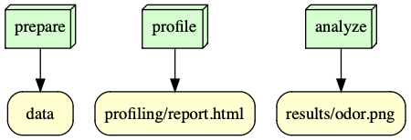

# is477-fall2023-final-project
[](https://zenodo.org/doi/10.5281/zenodo.10315640)
## Overview
This is the final project of IS 477 Data Management, Curation & Reproducibility in Fall 2023 by Shiyuan Liu. This is  This project uses the [Mushroom](https://archive.ics.uci.edu/dataset/73/mushroom) dataset from the [UCI Machine Learning Repository](https://archive.ics.uci.edu), which records data of hypothetical samples corresponding to 23 species of gilled mushrooms in the Agaricus and Lepiota Family. The dataset contains useful features about the mushrooms such as appearances, odor, population, habitat etc. This project downloads and validates the dataset, generates a profile of the dataset, and does a simple data visualization of the frequency of mushroom odor types.
## Analysis
In the analysis section, this project visualized the frequencies of mushroom odor types using a histogram (located in `results/odor.png`). The graph shows 9 types of odor in the dataset and among them, mushrooms without odor has the highest frequency while "musty" mushrooms occur the least frequent.
## Workflow
This project downloads and validates the Mushroom dataset, generates a profile of the dataset, and does a simple data visualization, as shown in the following workflow graph:


## Reproducing
To reproduce the work, first clone the repository, then pull the docker image by running the following command:
```
docker pull row0rl/is477-fall2023:final-project
```
Then, run the script by running the following command:
```
docker run --rm -v ${PWD}:/is477 row0rl/is477-fall2023:final-project snakemake --core 1 prepare
docker run --rm -v ${PWD}:/is477 row0rl/is477-fall2023:final-project snakemake --core 1 profile
docker run --rm -v ${PWD}:/is477 row0rl/is477-fall2023:final-project snakemake --core 1 analyze
```
## License
### Software License
This repository uses MIT License. This allows for the sharing and adaptation of the software for any purpose, including personal, commercial, academic, or non-profit projects. Users are free to modify, distribute, and sublicense the software, both in source code and binary form, provided that they include the original copyright notice and give appropriate credit to the original authors.
### Data License
The data in this repository is licensed under a [Creative Commons Attribution 4.0 International](https://creativecommons.org/licenses/by/4.0/legalcode) (CC BY 4.0) license. This allows for the sharing and adaptation of the datasets for any purpose, provided that the appropriate credit is given.
## References
Mushroom. (1987). Mushroom. UCI Machine Learning Repository. https://doi.org/10.24432/C5959T